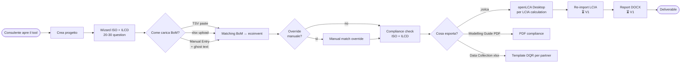
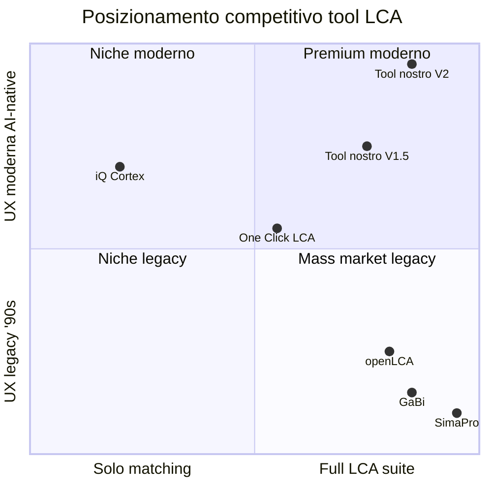
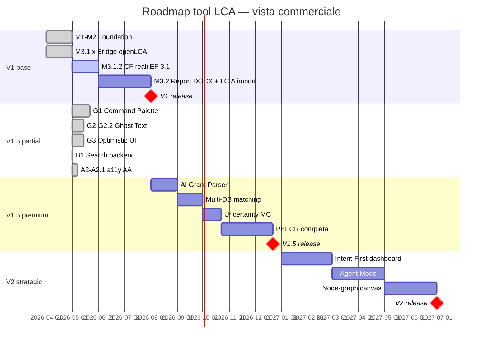

# FEATURE_MAP — Mappa funzionale del tool LCA

> **Aggiornato**: 2026-05-06 (post V1.5 partial COMPLETE).
> **Mantenuto da**: Architect unificato. Aggiornato a ogni sprint chiuso.
> **Vive su**: `lca-tool-coordination/FEATURE_MAP.md`.
>
> 2 sezioni:
> - **PARTE A — Vista tecnica** (per Mirko): cosa è realizzato, da chi, dove sta nel codice, sprint owner.
> - **PARTE B — Vista commerciale** (per pitch a clienti/partner): cosa fa il tool, posizionamento competitivo, V1 vs V1.5 vs V2.

---

# PARTE A — Vista tecnica

## A.1 Architettura in 1 schermata

Il tool è un'applicazione web client-server. 3 layer logici:

```mermaid
flowchart TB
  subgraph Frontend["FRONTEND — React 18 + Vite + Tailwind"]
    UI[UI: Wizard + Match + ManualEntry + Compliance + Palette ⌘K]
    GhostText[Ghost Text retrieval-only<br>G2/G2.1/G2.2]
    Optimistic[Optimistic UI<br>G3]
  end

  subgraph Backend["BACKEND — FastAPI + Python"]
    API[REST API /api/...]
    Matcher[Matching engine M1<br>23k processi ecoinvent]
    ProjectStore[Project store JSON-blob<br>schema v6]
    SuggestEP[/api/suggest<br>G2 / G2.1 / G2.2]
    SearchEP[/api/search/global<br>B1]
    ZolcaBuilder[zolca builder<br>M3.1.0.x / M3.1.1]
  end

  subgraph External["EXTERNAL"]
    ChromaDB[(ChromaDB index<br>multilingual-e5-large<br>1024-dim)]
    OpenLCA[openLCA Desktop 2.6.1<br>via .zolca + IPC]
    LLM[LLM tier ladder<br>Mistral / Sonnet]
  end

  UI --> API
  GhostText --> SuggestEP
  Optimistic --> API
  API --> Matcher
  API --> ProjectStore
  API --> ZolcaBuilder
  SuggestEP --> ChromaDB
  SearchEP --> ProjectStore
  Matcher --> ChromaDB
  Matcher --> LLM
  ZolcaBuilder -.->|file .zolca| OpenLCA
  OpenLCA -.->|IPC port 8080| ZolcaBuilder
```

## A.2 Stack tecnico

**Frontend**: React 18 + TypeScript + Vite + Tailwind CSS + TanStack Query v5 + zustand + react-router-dom 6 + cmdk + Vitest. ~150 modules. Bundle main 96.11 KB gzip post-A2.1.

**Backend**: FastAPI + Python 3.11 + ChromaDB + sentence-transformers (multilingual-e5-large) + asteval (parser parametri). 394 pytest + 4 skipped.

**External integrations**: openLCA Desktop 2.6.1 (via .zolca file + IPC porta 8080), LLM tier ladder Mistral Small 4 → Sonnet 4.6, JRC EF 3.1 CC-BY-4.0 (per CF reali in M3.1.2 in progress).

## A.3 Mappa funzionale gerarchica

Legenda stato: ✅ done | 🔄 in code | ⏳ planned V1.5 | 🔮 V2 | ⏸ parking

### Layer Modeling (frontend + backend collaborano)

| Funzione | Stato | Sprint owner | File chiave |
|---|---|---|---|
| **Goal & Scope wizard ISO 14040/44** | ✅ | M2.1 | `frontend/src/components/ProjectWizard.tsx` |
| Wizard ILCD compliance | ✅ | M2.x.2 | `frontend/src/components/ProjectWizard.tsx` |
| StudyContext + situation A/B/C1/C2 filtering | ✅ | M2.1 | `backend/services/studycontext.py` |
| **BoM ingestion canonical v1** | ✅ | M1.5 | `backend/services/bom_canonical.py` |
| BoM ingestion via TSV paste | ✅ | M1.5 | `backend/api/bom.py` |
| BoM ingestion via xlsx upload | ✅ | M1.5 | `backend/api/bom.py` |
| BoM ingestion via Manual Entry | ✅ | M1.5 | `frontend/src/components/ManualEntry.tsx` |
| Re-import BoM v2 con DQR | ⏳ V1.5 | — | — |
| **Modello parametrico** | ✅ | M2.x.1 | `backend/models/parametric.py` |
| Quantity / Parameter / Scenario | ✅ | M2.x.1 | idem |
| asteval expression parser | ✅ | M2.x.1 | idem |
| Editor scenari UI | ⏳ V1.5 | — | — |
| **Matching BoM ↔ ecoinvent** | ✅ | M1 | `backend/services/matcher.py` |
| Matcher M1 LLM tier ladder | ✅ | M1 | idem |
| Matcher confidence threshold ricalibrazione | ⏳ V1.5 | — | pending Mirko 15 BoM rows manual QA |
| **Process Editor** | ✅ minimale | M2.1 | `frontend/src/components/ProcessEditor.tsx` |
| Process Editor avanzato (multi-functional, allocation) | ⏳ V1.5 | — | — |
| **Compliance check ISO + ILCD** | ✅ | M2.x.2 | `backend/services/compliance.py` |
| `requires_disclosure_context` flag rule 5 | ✅ | M2.3 | idem |
| ComplianceBanner UI | ✅ | M2.x.2 | `frontend/src/components/ComplianceBanner.tsx` |
| Compliance Snapshot ricco (matrice standard × aspect) | ⏳ V1.5 | — | — |

### Layer Bridge openLCA

| Funzione | Stato | Sprint owner | File chiave |
|---|---|---|---|
| **Build .zolca** via olca-ipc Python | ✅ | M3.1.0 | `backend/services/zolca_builder.py` |
| UnitGroups embed | ✅ | M3.1.0.1 | idem |
| Manifest filename fix | ✅ | M3.1.0.2 | idem |
| DEFLATE strict compatibility | ✅ | M3.1.0.3 | idem |
| Process @id Derby VARCHAR(36) | ✅ | M3.1.0.4 | idem |
| OpenLCA-strict integration test harness | ✅ | M3.1.0.6 | `backend/tests/test_zolca_openlca_strict.py` |
| Preflight zolca via IPC pytest opt-in | ✅ | M3.1.0.7 | `backend/services/zolca_preflight.py` |
| **zolca full mapping** | ✅ | M3.1.1 | `backend/services/zolca_builder.py` |
| actors / locations / sources | ✅ | M3.1.1 | idem |
| lcia_method / lcia_categories / nw_sets | ✅ | M3.1.1 | idem |
| **CF reali JRC EF 3.1** | 🔄 | M3.1.2 | in progress |
| Real Characterization Factors embedded ~5 MB JSON CC-BY-4.0 | 🔄 | M3.1.2 | — |
| **Re-import LCIA results parser** | ⏳ V1 | M3.2 | — |
| Chart engine LCIA results | ⏳ V1 | M3.2 | — |

### Layer Reporting

| Funzione | Stato | Sprint owner | File chiave |
|---|---|---|---|
| **Modelling Guide PDF generator** | ✅ | M2.3.1 | `backend/services/modelling_guide.py` |
| **Data Collection Template xlsx** | ✅ | M2.3 | `backend/services/data_collection_template.py` |
| 6 tab DQR ISO/ILCD | ✅ | M2.3 | idem |
| Dropdown predefiniti (Source_type, Status) | ✅ | M2.3 | idem |
| **Report draft DOCX** | ⏳ V1 | M3.2 | — |
| Layout designer custom branding | 🔮 V2 | — | — |

### Layer GUI AI-native (Kimi research dossier)

| Funzione | Stato | Sprint owner | File chiave |
|---|---|---|---|
| **P2 Search-First — Command Palette ⌘K** | ✅ | G1 | `frontend/src/components/command-palette/CommandPalette.tsx` |
| Universal command surface | ✅ | G1 | `frontend/src/lib/commands/registerCommand.ts` |
| Mnemonic shortcuts | ✅ | G1 | idem |
| Context-awareness pathname | ✅ | G1 | idem |
| Search globale **entità** (palette cerca processi/flussi/parametri) | ⏳ V1.5 | G1.x post-B1 | backend già pronto |
| **P5 AI Grounding — Ghost Text inventory** | ✅ | G2 | `frontend/src/components/ghost-text/GhostInput.tsx` |
| Retrieval-only ChromaDB | ✅ | G2 | idem |
| Qualifier syntax `:IT :cutoff :market` | ✅ | G2.1 | `frontend/src/lib/ghost-text/parser.ts` |
| Sticky qualifier per progetto | ✅ | G2.1 | `frontend/src/lib/ghost-text/useStickyQualifiers.ts` |
| Process_name retrieval split (activity_type filter) | ✅ | G2.2 | `backend/api/suggest.py` |
| SuggestionOverlay z-index fix | ✅ | G2.2 | `frontend/src/components/ghost-text/SuggestionOverlay.tsx` |
| Filter chips UI alternative a qualifier | ⏳ V1.5 | — | — |
| Inline @-mention syntax | 🔮 V2 | — | — |
| **P3 Reversibile — Optimistic UI** | ✅ | G3 | `frontend/src/lib/optimistic/useOptimisticMutation.ts` |
| 4 mutations BomRow / Parameter / Match | ✅ | G3 | idem |
| Toast extraction zustand singleton | ✅ | G3 | `frontend/src/lib/toast/` |
| **Backend search globale entità** | ✅ | B1 | `backend/api/search.py`, `backend/services/global_search.py` |
| **a11y WCAG 2.1 AA compliance** | ✅ | A2 + A2.1 | tailwind.config.js, components/ui/Modal.tsx, etc. |
| Critical fixes (combobox, label, color contrast) | ✅ | A2 | — |
| Link contrast su dark theme (text-link AAA) | ✅ | A2.1 | tailwind.config.js |
| Moderate + Minor fixes (i18n, scope th, focus indicator) | ⏳ V1.5 | A3 | — |
| **P1 Intent-First dashboard** | 🔮 V2 | — | — |
| **P4 Multiple Views (Tree/Canvas/Table/Sankey)** | 🔮 V2 | — | — |
| **P7 Progressive Disclosure layer 3 node-graph** | 🔮 V2 | — | — |

### Premium tier V1.5 (parking)

| Funzione | Stato | Note |
|---|---|---|
| **AI Grant Parser** premium | ⏸ V1.5 | killer feature differenziante. Vedi `MASTER_PLAN.md §11`. |
| Multi-DB matching (EF / Agri-footprint / IDEMAT / Carbon Minds) | ⏸ V1.5 | workstream prep attivo |
| Uncertainty Monte Carlo UI | ⏸ V1.5 | — |
| PEFCR completa (CFF, DQR weighted, verification rules) | ⏸ V1.5 | rinviata da V1 |
| Multi-tenant SaaS infra | ⏸ V1.5 | — |

### V2 strategic backlog

| Funzione | Stato | Note |
|---|---|---|
| GUI redesign Kimi research full | 🔮 V2 | dossier ~80 pagine, vedi `MASTER_PLAN.md §12` |
| `premise` integration (prospective LCA IAM) | 🔮 V2 | — |
| LCA sociale / S-LCA | 🔮 V2 | — |
| Brightway2 alternative engine | 🔮 V2 | — |
| Mobile/iPad | 🔮 V2 | — |

## A.4 User journey del consulente (flow attuale V1)



Stadio attuale fine V1.5 partial: il flow funziona end-to-end fino a `.zolca` export. Il consulente apre `.zolca` su openLCA Desktop e fa il calcolo LCIA lì. Il re-import dei risultati e il report finale sono il prossimo workstream M3.2 (V1 release).

## A.5 Stato avanzamento numerico

| Metrica | Valore | Note |
|---|---|---|
| Sprint chiusi su main | 24 | M1, M1.5, M2.x family, M3.1.x family, G1, G2, G2.1, G2.2, G3, B1, A1, A2, A2.1 |
| Sprint in progress parallelo | 1 | M3.1.2 (CF EF 3.1) |
| Backend pytest baseline | 394 + 4 skipped | post V1.5 partial complete |
| Frontend vitest baseline | 70 | post-A2.1 |
| Bundle main gzip | 96.11 KB | cap +15 KB per sprint, +5 KB hot fix |
| ADR cumulativi | 40 | vedi `MASTER_PLAN.md §6` |
| WCAG 2.1 AA | 0 / 0 / 0 / 0 | verificato empirico axe-core 6 route 2026-05-06 |
| Database ecoinvent indicizzato | 23,000 processi | multilingual-e5-large 1024-dim |

## A.6 V1.5 partial COMPLETE — 2026-05-06

V1.5 partial = sottoinsieme di V1.5 che materializza 4 dei 7 principi Kimi (P2, P3, P5, P6 parzialmente) + WCAG 2.1 AA compliance. Composto da:

```
[x] G1     Command Palette ⌘K          ✅
[x] G2     Ghost Text inventory        ✅
[x] G2.1   Qualifier + layout          ✅
[x] G2.2   Process split + overflow    ✅
[x] G3     Optimistic UI                ✅
[x] B1     Global search backend       ✅
[x] A1     Audit a11y baseline          ✅
[x] A2     a11y Critical + Serious      ✅
[x] A2.1   Link contrast hot fix        ✅
```

Pronto per pitch istituzionale EU procurement.

---

# PARTE B — Vista commerciale

## B.1 Cosa fa il tool in 1 paragrafo

Il tool sostituisce un software LCA tradizionale (SimaPro, GaBi, openLCA Desktop come UI) per il workflow del consulente di Life Cycle Assessment. Permette di definire un progetto compliant ISO 14040/44 + ILCD con Goal & Scope wizard, costruire un inventario di Bill of Materials con matching automatico AI verso ecoinvent (23.000 processi indicizzati), validare la compliance per i diversi standard, generare la Modelling Guide PDF + Data Collection Template Excel per i partner di consortium EU, ed esportare un file `.zolca` direttamente importabile in openLCA per il calcolo LCIA. Target: **consulente LCA italiano** che lavora su progetti EU innovation, JRC, PEFCR, sustainability reporting per industria.

## B.2 Capabilities mappate al workflow LCA

| Stadio del workflow | Cosa offre il tool oggi (V1.5 partial) | Pain risolto vs alternative |
|---|---|---|
| **1. Goal & Scope** | Wizard guidato con ~30 question SHALL/SHOULD ISO + ILCD, situation filtering, compliance check by construction | SimaPro/GaBi: form generici, zero compliance assistance. openLCA: form minimale. |
| **2. Inventory (BoM)** | 4 modalità di ingestion (paste/upload/manual/template). Matching AI verso ecoinvent con confidence band. Ghost text retrieval-only su 23k processi con qualifier (`:IT :cutoff`). | SimaPro: matching manuale browse-and-pick. iQ Cortex: solo matching, no integrazione. openLCA: search nominale, no AI. |
| **3. Validazione & Compliance** | Compliance check ISO + ILCD multi-aspect, banner UI con disclosure flags rule 5. Modelling Guide PDF auto-generato. | Nessun competitor offre validation guidata. Compliance manuale = 4-8h consulente per studio. |
| **4. Modeling avanzato** | Modello parametrico (Quantity, Parameter, Scenario, asteval expression). | SimaPro: parametri base. openLCA: parametri locali/globali ma UI complessa. |
| **5. Calcolo LCIA** | Delega a openLCA Desktop via export `.zolca` + IPC. Importable bit-perfect. | Strategy choice: non rifacciamo il motore LCIA. Usiamo il migliore disponibile. |
| **6. Reporting** | Modelling Guide PDF + Data Collection Template xlsx (V1). Report draft DOCX (V1, in M3.2). | Competitor: report formati fissi tipo SimaPro PDF generic. PEFCR template assente. |
| **7. Collaborazione partner** | Data Collection Template xlsx 6-tab DQR per partner consortium, dropdown predefiniti, struttura DQR ISO/ILCD. | EU innovation projects: oggi lo si fa con file xlsx fai-da-te. |

## B.3 Posizionamento competitivo



| Competitor | Punto di forza | Punto debole | Prezzo |
|---|---|---|---|
| **SimaPro** | Standard di settore, DB completi | UX '90s, no AI, costo enterprise | €5,000-15,000/anno |
| **GaBi** (Sphera) | Robusto, EPD compliance | Pesante, no API, lock-in | €5,000-20,000/anno |
| **openLCA** | Free, open-source, motore solido | UX Eclipse RCP datata, nessuna guida | Free (consulenza GreenDelta a parte) |
| **iQ Cortex** | Solo AI matching, web-first, moderno | Solo matching, no full-stack | €290/mese |
| **One Click LCA** | Web SaaS moderno, EPD focus | Costruzioni-specific, generalist limitato | €500-2,000/mese |
| **Tool nostro V1.5** | Full-stack + AI matching + ISO/ILCD compliance + UX moderna + italiano | UX funzionale non ancora premium polish | **~99 €/mese V1 base** / **399-599 €/mese V1.5 premium** |

## B.4 Differenziali commerciali V1 vs V1.5

### V1 base — target consulenti R&D, EU innovation, ricercatori

**~99 €/mese** | volume play | self-service signup

- Matching AI BoM ↔ ecoinvent (23k processi indicizzati)
- Wizard ISO 14040/44 + ILCD compliance
- Modello parametrico (quantità, scenari)
- Export `.zolca` bit-perfect a openLCA
- Modelling Guide PDF auto-generata
- Data Collection Template xlsx per partner
- Compliance check by construction
- Report draft DOCX (M3.2)

### V1.5 premium — target studi 10+ progetti/anno, consortium leader EU

**399-599 €/mese** | white-glove onboarding | restricted access

Tutto V1 base **+**:

- 🤖 **AI Grant Parser** (killer feature): carichi il grant agreement PDF, AI propone le risposte del wizard Goal & Scope con confidence + citation. Speed-up 5-10x sul wizard.
- ⚡ **Command Palette ⌘K + Ghost Text + Optimistic UI** (UX moderna AI-native, principi Kimi P2 + P3 + P5 + P6)
- 🔍 **Search globale entità** (cerchi un processo/flusso/parametro nel modello con ⌘K)
- 📊 **Multi-DB matching** (EF, Agri-footprint, IDEMAT, Carbon Minds)
- 🎲 **Uncertainty Monte Carlo UI**
- 📋 **PEFCR completa** (CFF formula engine, DQR weighted, verification rules)
- ♿ **WCAG 2.1 AA compliance** (sblocco mercato istituzionale EU procurement)

### V2 redesign — target studi enterprise + multi-tenant SaaS

**Pricing TBD** | enterprise contract

Tutto V1.5 **+**:

- Intent-First dashboard ("cosa devo fare oggi?")
- Multiple Views (Tree / Canvas / Table / Sankey switch istantaneo)
- Agent Mode (AI pianifica lo studio LCA con plan visibile/editabile)
- Node-graph canvas per modeling esperto (pattern Houdini/Blender)
- Block-based report editor (pattern Notion)
- `premise` integration (prospective LCA IAM scenarios REMIND/IMAGE/TIAM-UCL)
- LCA sociale / S-LCA
- Multi-tenant infrastructure
- Mobile/iPad

## B.5 Roadmap visibile



## B.6 Pitch one-liner per situazioni diverse

**A un consulente LCA solo**: "È SimaPro ma con AI matching, UX moderna, compliance built-in, e a 99 €/mese."

**A uno studio EU innovation**: "Compri tempo: 8 ore di wizard Goal & Scope diventano 1 ora con AI Grant Parser che legge il tuo grant agreement e propone le risposte."

**A un buyer istituzionale**: "Tool web italiano, WCAG 2.1 AA compliant verificato, ISO 14040/44 + ILCD by construction, exporta `.zolca` bit-perfect verso openLCA standard EU."

**A un investor**: "Stiamo costruendo il primo tool LCA AI-native con full stack modeling + reporting. iQ Cortex fa solo matching a 290 €/mese, noi facciamo tutto a 99 €/mese base / 399-599 €/mese premium."

## B.7 Cosa NON è

Per chiarezza, il tool **non**:

- Non è un motore LCIA. Il calcolo resta su openLCA (strategic delega, non re-implementato).
- Non è una libreria di Characterization Factors. Usiamo quelle di openLCA + JRC EF 3.1 CC-BY-4.0.
- Non sostituisce ecoinvent o altri DB commerciali. Resta BYOL (Bring Your Own License).
- Non fa LCA sociale / S-LCA (V2 backlog).
- Non è mobile-first (out of scope).

---

**Fine FEATURE_MAP.**

> Aggiornare questo documento è responsabilità di Architect a ogni sprint chiuso. Il valore del documento deriva dall'essere sempre allineato con `_CURRENT_STATE.md` e `MASTER_PLAN.md`. Se uno dei 3 documenti è stale, è un bug del workflow operativo.
